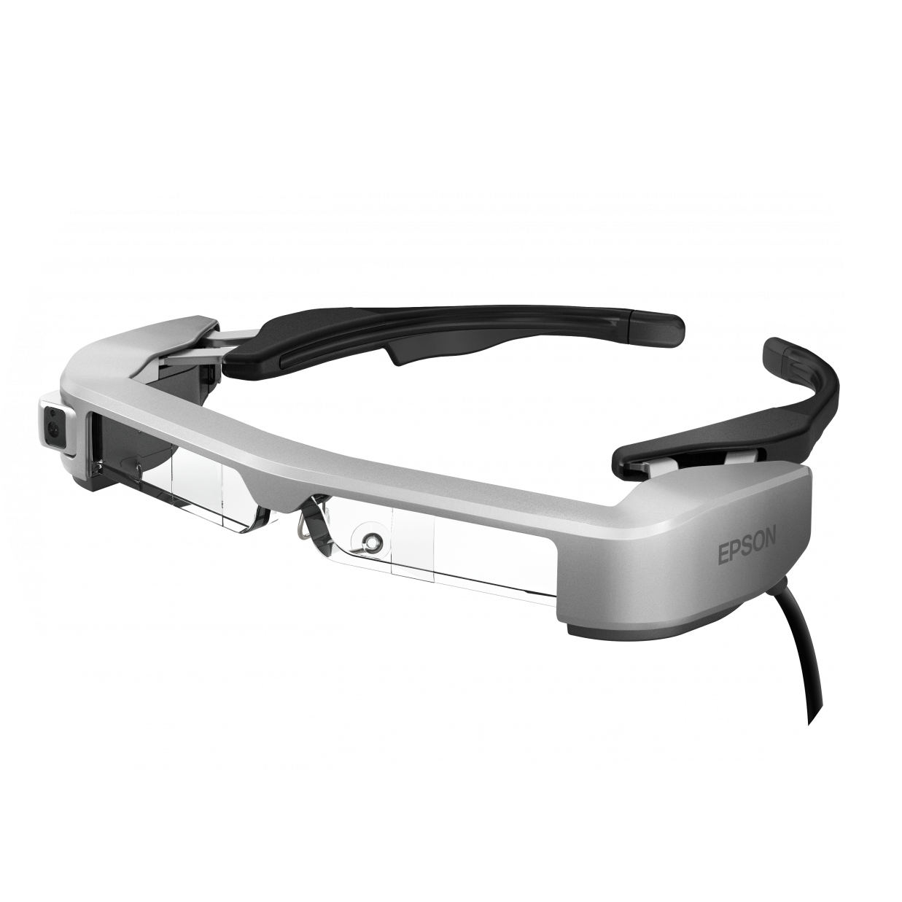
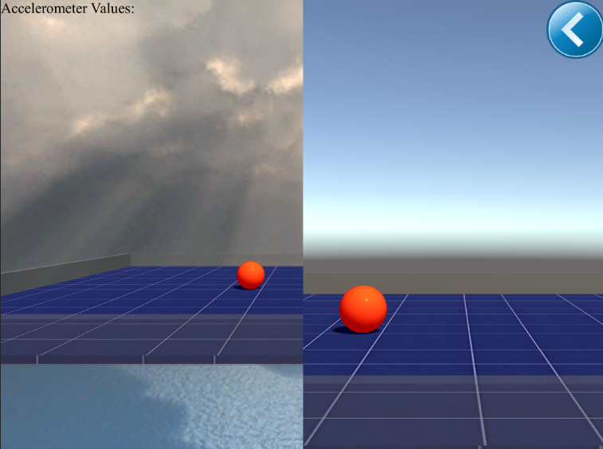
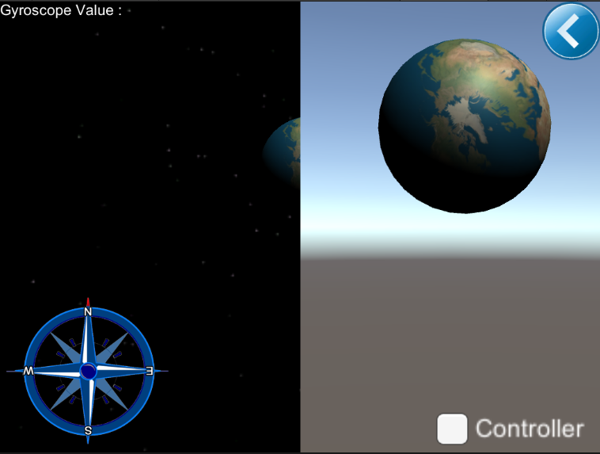
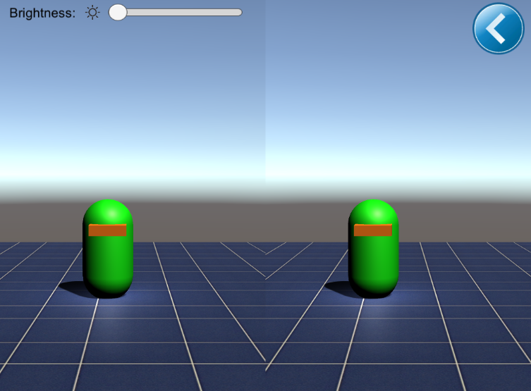
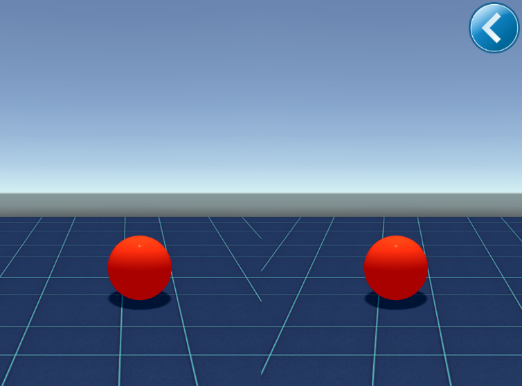
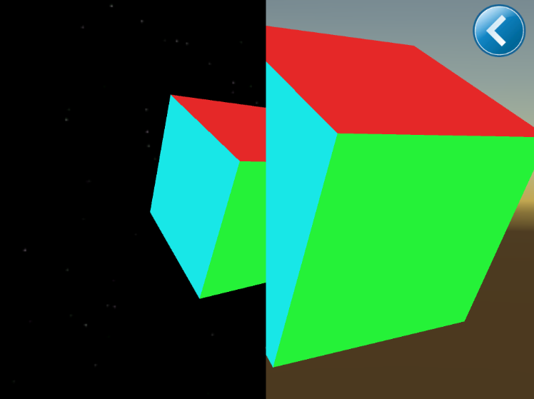

# BT-300 / BT-350 Sample Unity App with Visual Studio

<p align="center">
  
</p>

<!-- TOC -->

- [BT-300 / BT-350 Sample Unity App with Visual Studio](#bt-300--bt-350-sample-unity-app-with-visual-studio)
  - [Introduction](#introduction)
    - [Accelerometer Module](#accelerometer-module)
    - [Gyroscope Module](#gyroscope-module)
    - [Controller & Illumination Sensor Module](#controller--illumination-sensor-module)
    - [Accelerometer Gyroscope Headset Module](#accelerometer-gyroscope-headset-module)
    - [Rotational Vector Module](#rotational-vector-module)
    - [Headset Tap Feature](#headset-tap-feature)
  - [Application Requirements and Installation](#application-requirements-and-installation)
  - [Architecture](#architecture)
    - [.NET](#net)
    - [Unity](#unity)

<!-- /TOC -->

## Introduction

This is a sample application built using the following plugin for the BT-300 / BT-350:
https://github.com/moverio/BT300-Unity_Plugin-Preview

This will show how to read data from various sensors for use in a Unity Project with Visual Studio.

This Application Demonstrates the Following Features:

### Accelerometer Module

The working of this module demonstrates Headset and controller movement.
A ball moves on the basis of Device's accelerometer values.

<p align="center">
  
</p>

### Gyroscope Module

This module is to demonstrate see-through capability of the glass as well as the Gyroscopic value.
Magnetometer will locate the real North on the basis of controller's Magnetic field raw data.

<p align="center">
  
</p>

### Controller & Illumination Sensor Module

This module shows demonstrate device's handheld controller and illumination sensor mentioned below.
(a)   Enterkey: Changes capsule color.
(b)   Crosskey: Adjusts the plane according to eyesight.
(c)   Trackpad: Moves the capsule on the basis of touch input.
(d)   Brightness Bar: Changes the intensity of screen brightness.

<p align="center">
  
</p>

### Accelerometer Gyroscope Headset Module

This module is the combination of Accelerometer and Gyroscopic values.
Two planes with Green and Red ball can be observed.
One ball at a time can move, if it is visible to eyesight.

<p align="center">
  
</p>

### Rotational Vector Module

This module is based on the handheld device's rotation values.
A cube is placed to show the rotation in all axis.

<p align="center">
  
</p>

### Headset Tap Feature

While in a scene described above, the user can tap the headset to change to the next scene.

## Application Requirements and Installation

Requirements: EPSON Moverio BT-300 or BT-350 Smart Glasses, Unity Editor 2019 or above, Visual Studio Code.

How to import the project into Unity Editor:

- Clone this repo to your local machine.
- Get a Unity License from https://store.unity.com/ and install locally.
- Get a Visual Studio Code
- Go to File->Open and navigate to the “EpsonMoverioBT300Unity1.1” folder.
- Click “Open” and the project will be imported into Unity.
- In Unity->Edit->Preferences...->"External Tools". Select Visual Studio as external script editor and unselect all checkboxes to create aditional projects.

How to install application onto the device:

- Copy the .apk (Andriod Package Kit) file into the device's memory.
- Locate the .apk using file explorer.
- Click on file and install it.
- Run the application.

Configuration: The BT-300 runs Android 5.1 or API Level 22.

See Also:

```html
BT-300 Unity Plugin: https://github.com/moverio/BT300-Unity_Plugin-Preview
BT-300 SDK: https://tech.moverio.epson.com/en/bt-300/sdk_download.html
BT-300 Documentation: https://tech.moverio.epson.com/en/bt-300/document.html
BT-350 Documentation: https://tech.moverio.epson.com/en/bt-350/document.html
Get Unity: https://store.unity.com/
```

## Architecture

### .NET

<p align="center">
  
  <p align = "center">Type Dependencies Diagram for Accelerometer and other elements by folders</p>
</p>

<p align="center">
  
  <p align = "center">Type Dependencies Diagram for Accelerometer and other elements</p>
</p>

### Unity

<p align="center">
  
  <p align = "center">Architecture view for EpsonMoverioBT300Unity1.1</p>
</p>